# Obsidian Sidekick — Architecture & Document Processing Flow

## High-Level Module Map

```
┌─────────────────────────────────────────────────────────────────────┐
│                         Obsidian Host App                           │
│  ┌────────────┐  ┌────────────┐  ┌──────────┐  ┌───────────────┐  │
│  │  Workspace  │  │   Vault    │  │  Editor  │  │  File System  │  │
│  │   Events    │  │   API      │  │  (CM6)   │  │   Events      │  │
│  └─────┬──────┘  └─────┬──────┘  └────┬─────┘  └───────┬───────┘  │
└────────┼───────────────┼──────────────┼─────────────────┼──────────┘
         │               │              │                 │
┌────────▼───────────────▼──────────────▼─────────────────▼──────────┐
│                      main.ts  (SidekickPlugin)                      │
│  Lifecycle: onload / onunload                                       │
│  Registers: view, commands, ribbon, editor menu, CM6 ext, settings  │
└──┬──────────┬──────────┬───────────┬──────────┬──────────┬─────────┘
   │          │          │           │          │          │
   ▼          ▼          ▼           ▼          ▼          ▼
┌──────┐ ┌────────┐ ┌────────┐ ┌─────────┐ ┌──────┐ ┌──────────┐
│copilot│ │sidekick│ │editor  │ │ghost    │ │edit  │ │config    │
│.ts    │ │View.ts │ │Menu.ts │ │Text.ts  │ │Modal │ │Loader.ts │
│       │ │        │ │        │ │         │ │.ts   │ │          │
│Copilot│ │Main UI │ │Context │ │Inline   │ │Form  │ │YAML      │
│Client │ │Chat    │ │Menus   │ │Suggest  │ │Modal │ │Frontmatter│
│Session│ │Triggers│ │        │ │CM6 Ext  │ │      │ │Parser    │
│Auth   │ │Search  │ │        │ │         │ │      │ │          │
└──┬────┘ └───┬────┘ └───┬────┘ └────┬────┘ └──┬───┘ └────┬─────┘
   │          │          │           │          │          │
   │   ┌──────┼──────────┼───────────┼──────────┘          │
   │   │      │          │           │                     │
   ▼   ▼      ▼          ▼           ▼                     ▼
┌──────────────────────────────────────────────────────────────────┐
│                    Supporting Modules                             │
│  tasks.ts         types.ts       triggerScheduler.ts   debug.ts  │
│  (Built-in        (Interfaces)   (Cron + Glob          (Logging) │
│   prompts)                        scheduling)                    │
│                   vaultScopeModal.ts  settings.ts                │
│                   (Folder/file        (Settings UI)              │
│                    picker)                                       │
└──────────────────────────────────────────────────────────────────┘
```

---

## Document Processing Entry Points

There are **six primary pathways** through which documents are processed:

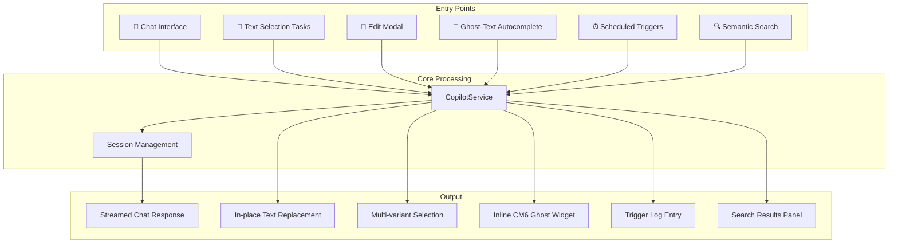

---

## 1. Chat Message Flow (Primary Path)

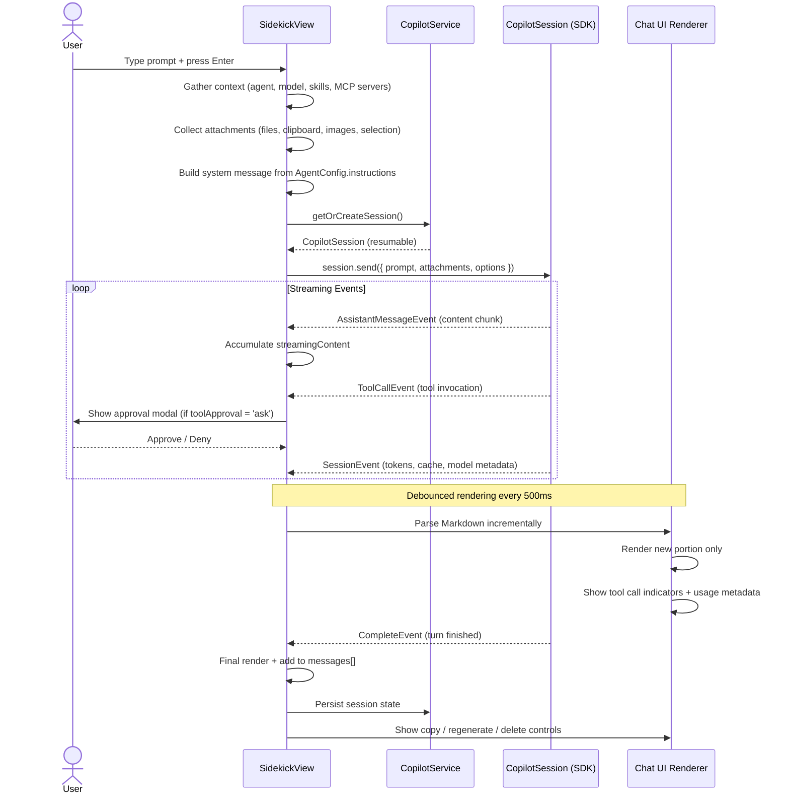

---

## 2. Text Selection Tasks Flow

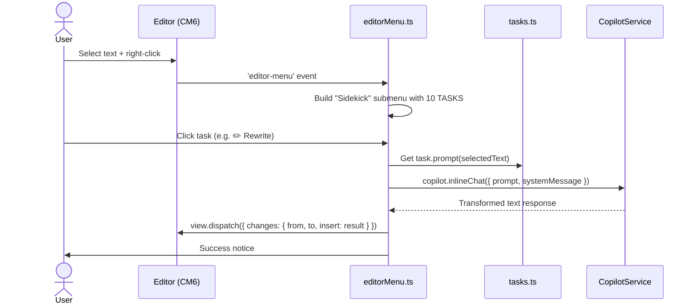

### Built-in Tasks
| Task | Description |
|------|-------------|
| ✏️ Rewrite | Rephrase selected text |
| 🔍 Proofread | Fix grammar and spelling |
| 📝 Expand | Elaborate on the selection |
| 📐 Shorten | Condense the text |
| 💡 Simplify | Make it easier to understand |
| 🔬 Formalize | Make tone more formal |
| 💬 Casualize | Make tone more casual |
| 🌐 Translate | Translate to another language |
| 📋 Summarize | Create a summary |
| 📊 Key points | Extract key points |

---

## 3. Ghost-Text Autocomplete Flow

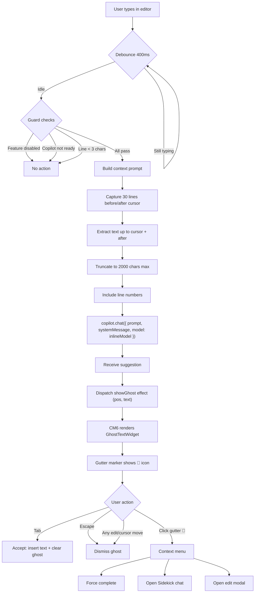

---

## 4. Trigger Scheduler Flow

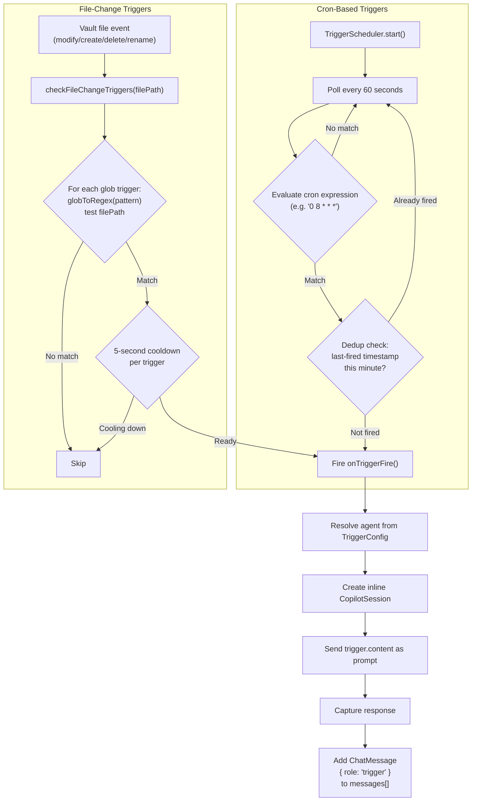

---

## 5. Configuration Loading Flow

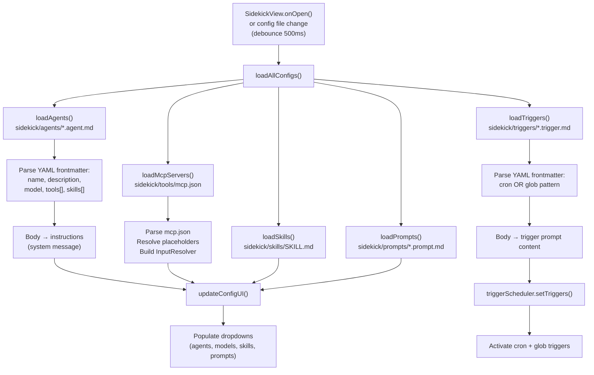

### Vault Configuration Structure
```
<vault>/
  sidekick/
    agents/         ← *.agent.md  (YAML frontmatter + instructions body)
    skills/         ← SKILL.md files
    tools/          ← mcp.json (MCP server definitions)
    prompts/        ← *.prompt.md (reusable prompt templates)
    triggers/       ← *.trigger.md (cron or glob + prompt body)
```

---

## 6. Session Management & Persistence

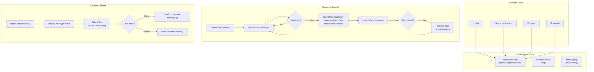

---

## 7. Attachment System

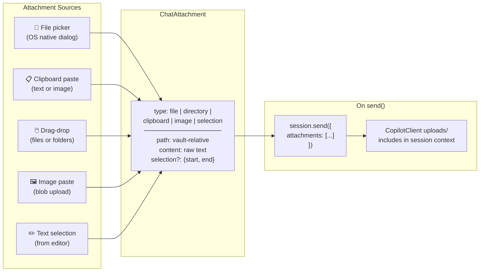

---

## End-to-End: Complete Plugin Initialization

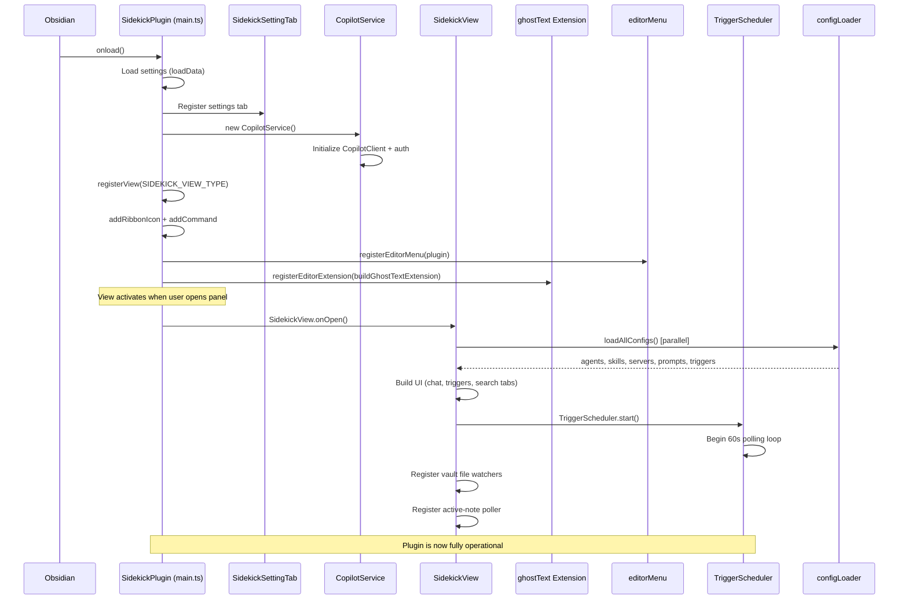

---

## Module Dependency Graph

```
main.ts
├── copilot.ts          (CopilotService)
├── sidekickView.ts     (SidekickView)
│   ├── copilot.ts
│   ├── configLoader.ts (loadAgents, loadTriggers, loadSkills, ...)
│   ├── triggerScheduler.ts (TriggerScheduler)
│   ├── editModal.ts    (EditModal)
│   ├── vaultScopeModal.ts (VaultScopeModal)
│   ├── tasks.ts        (TASKS array)
│   ├── types.ts        (all interfaces)
│   └── debug.ts        (debugTrace)
├── editorMenu.ts       (registerEditorMenu)
│   ├── copilot.ts
│   ├── tasks.ts
│   └── editModal.ts
├── ghostText.ts        (buildGhostTextExtension)
│   └── copilot.ts
├── settings.ts         (SidekickSettingTab)
│   └── types.ts
└── types.ts            (shared interfaces — no internal deps)
```

---

## Key Data Types

| Type | File | Purpose |
|------|------|---------|
| `ChatMessage` | types.ts | Single message in conversation (role, content, metadata) |
| `AgentConfig` | types.ts | Agent definition (name, model, tools, instructions) |
| `TriggerConfig` | types.ts | Trigger definition (cron/glob, agent, content) |
| `SkillConfig` | types.ts | Skill metadata |
| `McpServerConfig` | types.ts | MCP server connection definition |
| `PromptConfig` | types.ts | Reusable prompt template |
| `ChatAttachment` | types.ts | File/clipboard/image/selection attachment |
| `SidekickSettings` | types.ts | Persisted plugin settings |

---

# Context & Search Efficiency Analysis

## Current Context Pipeline — What Goes Wrong

The plugin currently uses a **pass-through architecture**: vault content goes straight to the Copilot SDK with no local intelligence layer. Every pathway has the same structural problem—the plugin acts as a dumb pipe between the vault and the LLM.

```
┌─────────────────────────────────────────────────────────────────────────┐
│                    CURRENT: Pass-Through Architecture                    │
│                                                                          │
│   ┌──────────┐     ┌──────────────┐     ┌──────────┐     ┌──────────┐  │
│   │  Vault    │────▶│  Raw Content │────▶│  Copilot │────▶│  LLM     │  │
│   │  Files    │     │  (verbatim)  │     │  SDK     │     │  (remote)│  │
│   └──────────┘     └──────────────┘     └──────────┘     └──────────┘  │
│                                                                          │
│   No indexing ──── No chunking ──── No caching ──── No dedup            │
│                                                                          │
│   Problems:                                                              │
│   • Every query re-reads entire scope from disk                         │
│   • Identical searches hit the LLM every time                           │
│   • Context budget wasted on irrelevant content                         │
│   • No awareness of document structure or relationships                 │
│   • No differential context across conversation turns                   │
└─────────────────────────────────────────────────────────────────────────┘
```

---

## Problem Breakdown by Pathway

### P1. Chat Context — Brute-Force Scope

```
                           CURRENT FLOW
                           ════════════

    User sends: "What are my project deadlines?"
                      │
                      ▼
    ┌─────────────────────────────────┐
    │ buildSdkAttachments()           │
    │                                 │
    │  For each scope path:           │
    │    → Send entire directory      │──── 500+ files sent raw
    │                                 │     to SDK on EVERY message
    │  For each attachment:           │
    │    → Send full file content     │──── No relevance filter
    │                                 │
    │  + Inline clipboard text        │
    │  + Inline selection text        │
    │  + Cursor position              │
    └─────────────────────────────────┘
                      │
                      ▼
    SDK receives everything → Truncates to fit context window
                      │
                      ▼
    LLM sees partial/random slice of vault ← LOSSY
```

**What's wrong:**
- Scope paths are re-sent on **every message** in a conversation — no incremental/diff
- No relevance filtering — all files in scope sent regardless of query
- SDK does the truncation invisibly — user doesn't know what was cut
- No file metadata pre-filter (tags, links, frontmatter) to narrow before sending

### P2. Search — Zero Local Intelligence

```
                           CURRENT FLOW
                           ════════════

    User searches: "meeting notes from January"
                      │
                      ▼
    ┌─────────────────────────────────┐
    │ handleBasicSearch()             │
    │                                 │
    │  prompt = boilerplate +         │
    │          "Query: {user input}"  │
    │                                 │
    │  attachments = [{               │
    │    type: 'directory',           │──── Entire scope sent
    │    path: scopePath              │     as one big attachment
    │  }]                             │
    │                                 │
    │  session.sendAndWait()          │──── 120s timeout
    │                                 │     (can be VERY slow)
    └─────────────────────────────────┘
                      │
                      ▼
    LLM must:
      1. Index/scan all files in directory ← Done from scratch EVERY TIME
      2. Understand query semantics
      3. Rank by relevance
      4. Return JSON array
                      │
                      ▼
    Plugin parses JSON → renderSearchResults()

    ┌─────────────────────────────────────────────┐
    │  COST PER SEARCH:                            │
    │  • LLM reads entire vault scope (expensive)  │
    │  • No caching (same query = same cost)        │
    │  • No pre-filtering (send everything)         │
    │  • 120s timeout (can still fail on big vaults)│
    │  • Non-deterministic results (LLM variance)   │
    └─────────────────────────────────────────────┘
```

**What's wrong:**
- Every search is a cold start — LLM re-reads all files
- No query result cache — searching "meeting notes" twice costs 2x
- No local pre-filter using file metadata (name, tags, dates, links)
- Results are non-deterministic (same query can produce different rankings)
- Advanced search creates a **new session per query** (session setup overhead)

### P3. Ghost Text — Narrow, Dumb Window

```
                           CURRENT FLOW
                           ════════════

    User typing in editor...
                      │
                      ▼
    ┌─────────────────────────────────┐
    │ Ghost-text context builder      │
    │                                 │
    │  before = 30 lines before cursor│
    │  after  = 30 lines after cursor │
    │                                 │
    │  if (before + after > 2000) {   │──── HARD TRUNCATION
    │    before = before[-1000:]      │     • May cut mid-sentence
    │    after  = after[:1000]        │     • May cut mid-code-block
    │  }                              │     • No structure awareness
    │                                 │
    │  prompt = before+CURSOR+after   │
    └─────────────────────────────────┘
                      │
                      ▼
    LLM sees isolated 2000-char window
    • No vault context (what other files reference this?)
    • No frontmatter (what type of document is this?)
    • No heading hierarchy (what section is this within?)
```

**What's wrong:**
- 2000 char hard limit with naive split — can break mid-word/sentence
- No awareness of document structure (headings, code blocks, lists)
- No cross-file context (the current file may reference others)
- No frontmatter context (type of document, tags, related files)

### P4. Triggers — Contextless Fire-and-Forget

```
                           CURRENT FLOW
                           ════════════

    File changed: "projects/quarterly-review.md"
                      │
                      ▼
    ┌─────────────────────────────────┐
    │ fireTriggerInBackground()       │
    │                                 │
    │  prompt = trigger.content       │
    │                                 │
    │  if (context?.filePath) {       │
    │    prompt = "[File changed:     │──── ONLY file path
    │     {path}]\n\n" + content      │     No diff, no content,
    │  }                              │     no related files
    │                                 │
    │  // No vault scope attached     │──── NONE
    │  // No file content included    │──── NONE
    │  // No change diff provided     │──── NONE
    │  session.send({prompt})         │
    └─────────────────────────────────┘
                      │
                      ▼
    LLM knows: "a file changed at this path"
    LLM doesn't know: what changed, what's in it, what's related
```

**What's wrong:**
- Only sends file path, not the actual content or diff
- No vault scope attached — LLM can't reference other files
- No change context — what was added/removed/modified?
- No related-file graph — what links to or from this file?

---

## Missing Architectural Layers

```
┌──────────────────────────────────────────────────────────────────────────┐
│                  WHAT'S MISSING (layered from bottom up)                   │
│                                                                           │
│  ┌────────────────────────────────────────────────────────────────────┐   │
│  │ Layer 5: RESULT CACHE                                              │   │
│  │  • Query → result map with TTL                                     │   │
│  │  • Invalidated on relevant file changes                            │   │
│  │  • Dedup identical/similar queries                                 │   │
│  │  Currently: ❌ Every query is cold                                 │   │
│  └────────────────────────────────────────────────────────────────────┘   │
│                                                                           │
│  ┌────────────────────────────────────────────────────────────────────┐   │
│  │ Layer 4: SMART CONTEXT SELECTION                                   │   │
│  │  • Relevance scoring before sending to LLM                        │   │
│  │  • Token budget management with priority queue                    │   │
│  │  • Incremental/differential context across turns                  │   │
│  │  Currently: ❌ Everything sent verbatim                           │   │
│  └────────────────────────────────────────────────────────────────────┘   │
│                                                                           │
│  ┌────────────────────────────────────────────────────────────────────┐   │
│  │ Layer 3: DOCUMENT GRAPH                                            │   │
│  │  • Wikilink / markdown-link resolution                            │   │
│  │  • Backlink index (what references this file?)                    │   │
│  │  • Tag co-occurrence map                                          │   │
│  │  • Folder-level topic clustering                                  │   │
│  │  Currently: ❌ Files treated as isolated blobs                    │   │
│  └────────────────────────────────────────────────────────────────────┘   │
│                                                                           │
│  ┌────────────────────────────────────────────────────────────────────┐   │
│  │ Layer 2: METADATA INDEX                                            │   │
│  │  • Frontmatter properties (tags, aliases, dates, types)           │   │
│  │  • Heading structure (H1/H2/H3 hierarchy)                         │   │
│  │  • File stats (size, modified date, word count)                   │   │
│  │  • Named entities / key phrases                                   │   │
│  │  Currently: ❌ No metadata extracted or cached                    │   │
│  └────────────────────────────────────────────────────────────────────┘   │
│                                                                           │
│  ┌────────────────────────────────────────────────────────────────────┐   │
│  │ Layer 1: VAULT WATCHER + INCREMENTAL PROCESSOR                     │   │
│  │  • File change events → incremental re-index                      │   │
│  │  • Debounced batch processing                                     │   │
│  │  • Content hashing for change detection                           │   │
│  │  Currently: ❌ Only watches for config file changes               │   │
│  └────────────────────────────────────────────────────────────────────┘   │
│                                                                           │
└──────────────────────────────────────────────────────────────────────────┘
```

---

## Proposed: Optimized Context Reference Architecture

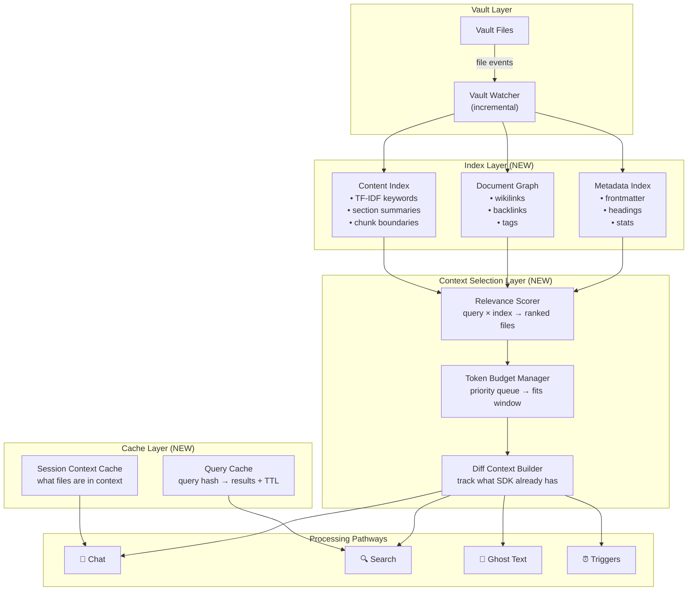

### How Each Pathway Would Improve

```
┌─────────────────────────────────────────────────────────────────────────┐
│  OPTIMIZED: Chat Context                                                 │
│                                                                          │
│  User: "What are my project deadlines?"                                  │
│                                                                          │
│  1. Relevance Scorer queries metadata index:                            │
│     → Tags: #deadline, #project, #due-date                              │
│     → Frontmatter: type=project, status=active                          │
│     → Links: files that reference "deadline" or "due"                   │
│                                                                          │
│  2. Token Budget Manager ranks matches:                                 │
│     → Top 10 most relevant files selected                               │
│     → Within each file: only relevant sections included                 │
│     → Total fits within context budget                                  │
│                                                                          │
│  3. Diff Context Builder:                                               │
│     → Already in session context? Skip.                                  │
│     → Only send NEW or CHANGED files since last turn                    │
│                                                                          │
│  Result: 10 relevant files instead of 500 raw files                     │
└─────────────────────────────────────────────────────────────────────────┘

┌─────────────────────────────────────────────────────────────────────────┐
│  OPTIMIZED: Search                                                       │
│                                                                          │
│  User: "meeting notes from January"                                      │
│                                                                          │
│  1. Query Cache check:                                                  │
│     → Cache hit? Return instantly (no LLM call)                         │
│                                                                          │
│  2. Metadata pre-filter (LOCAL, no LLM):                                │
│     → Filename contains "meeting"? → score +3                           │
│     → Tags include #meeting? → score +3                                 │
│     → Modified in January? → score +2                                   │
│     → Content mentions "meeting"? → TF-IDF score                       │
│     Pre-filtered from 500 → 25 candidates                              │
│                                                                          │
│  3. LLM re-rank (only if needed):                                       │
│     → Send 25 file summaries (not full content)                         │
│     → LLM ranks by semantic relevance                                   │
│     → Result cached with TTL                                            │
│                                                                          │
│  Result: 10x faster, 20x cheaper, deterministic local results           │
└─────────────────────────────────────────────────────────────────────────┘

┌─────────────────────────────────────────────────────────────────────────┐
│  OPTIMIZED: Ghost Text                                                   │
│                                                                          │
│  User typing in: "projects/quarterly-review.md"                          │
│                                                                          │
│  1. Structure-aware window:                                             │
│     → Detect current heading section → include full section             │
│     → Respect code block / list boundaries on truncation                │
│     → Include frontmatter as metadata header                            │
│                                                                          │
│  2. Cross-file context (from Document Graph):                           │
│     → This file links to: budget.md, team.md                           │
│     → Include 1-line summaries of linked files                          │
│     → Include heading structure of current file                         │
│                                                                          │
│  3. Smart truncation:                                                   │
│     → Break at sentence/paragraph boundaries                            │
│     → Preserve structural markers (headings, list items)                │
│     → Prioritize content closer to cursor                               │
│                                                                          │
│  Result: richer context, better completions, no mid-word cuts           │
└─────────────────────────────────────────────────────────────────────────┘

┌─────────────────────────────────────────────────────────────────────────┐
│  OPTIMIZED: Triggers                                                     │
│                                                                          │
│  File changed: "projects/quarterly-review.md"                            │
│                                                                          │
│  1. Change-aware context:                                               │
│     → Compute diff (before/after) from cached content hash             │
│     → Include: what sections changed, what was added/removed            │
│                                                                          │
│  2. Graph-aware context:                                                │
│     → Backlinks: files that reference quarterly-review.md               │
│     → Forward links: files this document references                     │
│     → Include summaries of directly connected files                     │
│                                                                          │
│  3. Scoped vault snapshot:                                              │
│     → Attach relevant scope (e.g., projects/ folder)                    │
│     → Include file tree of related folder                               │
│                                                                          │
│  Result: trigger knows WHAT changed, WHY it matters, WHAT's related     │
└─────────────────────────────────────────────────────────────────────────┘
```

---

## Implementation Priority Matrix

```
                        Impact
                   Low ──────── High
                   │              │
  Easy ─── ┌──────┼──────────────┤
            │      │     P2       │
  Effort    │      │  Query Cache │
            │      │              │
            │ P1   │     P3       │
            │Ghost │  Metadata    │
            │smart │  Pre-filter  │
            │trunc │  for Search  │
            │      │              │
            ├──────┼──────────────┤
            │      │     P4       │
  Hard ──── │      │  Document    │
            │ P6   │  Graph +     │
            │Embed-│  Token Budget│
            │dings │              │
            │      │     P5       │
            │      │  Trigger     │
            │      │  Diff Context│
            └──────┼──────────────┘
```

| Priority | Change | Effort | Impact | Files Affected |
|----------|--------|--------|--------|----------------|
| **P1** | Smart truncation for ghost text (sentence/structure boundaries) | Low | Medium | ghostText.ts |
| **P2** | Query result cache (hash → results with TTL, invalidate on file change) | Low | High | sidekickView.ts |
| **P3** | Metadata pre-filter for search (filename, tags, dates via `app.metadataCache`) | Medium | High | sidekickView.ts, new: vaultIndex.ts |
| **P4** | Document graph + token budget manager (link resolution, relevance scoring) | High | High | new: contextBuilder.ts, sidekickView.ts |
| **P5** | Trigger diff context (content hashing, before/after comparison) | Medium | Medium | triggerScheduler.ts, sidekickView.ts |
| **P6** | Local embeddings (TF-IDF or BM25 for keyword search) | High | Medium | new: searchIndex.ts |

### Quick Win: Obsidian's Built-in `MetadataCache`

Obsidian already maintains a metadata cache (`app.metadataCache`) that provides:
- Frontmatter properties (tags, aliases, custom fields)
- Heading structure
- Links (internal wikilinks and markdown links)
- Embeds
- List items
- Sections (with line offsets)

**This is currently unused by the plugin.** Leveraging it would provide layers 2-3 of the proposed architecture with zero indexing overhead.

---

# Comparative Analysis: Sidekick vs. Obsidian Intelligence Layer (OIL)

## What They Are

| | **Obsidian Sidekick** | **Obsidian Intelligence Layer (OIL)** |
|---|---|---|
| **Type** | Obsidian Community Plugin (runs inside Obsidian) | MCP Server (standalone Node.js process) |
| **Protocol** | Direct SDK calls (`@github/copilot-sdk`) | Model Context Protocol (stdio) |
| **Runtime** | Inside Obsidian's Electron sandbox | Independent process, any MCP client |
| **Vault access** | Via Obsidian's `app.vault` API | Direct filesystem reads (Node `fs`) |
| **Requires Obsidian running?** | Yes | No |
| **Agent compatibility** | GitHub Copilot (via SDK) | Any MCP client (Copilot, Claude, custom) |

## Architecture Comparison

```
┌─────────────────────────────────────────────────────────────────────────────┐
│  SIDEKICK: Plugin Architecture (runs INSIDE Obsidian)                        │
│                                                                              │
│  ┌──────────┐    ┌──────────────┐    ┌──────────────┐    ┌───────────┐     │
│  │ Obsidian │───▶│  Sidekick    │───▶│  Copilot SDK │───▶│  LLM      │     │
│  │ Vault API│    │  Plugin      │    │  (direct)    │    │  (remote) │     │
│  └──────────┘    │              │    └──────────────┘    └───────────┘     │
│                  │ • Raw files  │                                           │
│                  │ • No index   │    ← LLM does ALL the heavy lifting      │
│                  │ • No graph   │                                           │
│                  │ • No cache   │                                           │
│                  └──────────────┘                                           │
└─────────────────────────────────────────────────────────────────────────────┘

┌─────────────────────────────────────────────────────────────────────────────┐
│  OIL: MCP Server Architecture (runs OUTSIDE Obsidian)                        │
│                                                                              │
│  ┌──────────┐    ┌──────────────────────────────────┐    ┌───────────┐     │
│  │ Vault    │───▶│  OIL Server                       │◀──│  MCP      │     │
│  │ (disk)   │    │  ┌─────────┐  ┌───────────────┐  │   │  Client   │     │
│  │          │    │  │ Graph   │  │ Search Engine  │  │   │  (any     │     │
│  │          │    │  │ Index   │  │ 3-tier:        │  │   │  agent)   │     │
│  │          │    │  │ O(1)    │  │ lex→fuz→sem    │  │   └───────────┘     │
│  │          │    │  └─────────┘  └───────────────┘  │                      │
│  │          │    │  ┌─────────┐  ┌───────────────┐  │                      │
│  │          │    │  │ Session │  │ Embedding      │  │                      │
│  │          │    │  │ Cache   │  │ Index (384d)   │  │                      │
│  │          │    │  │ LRU 200 │  │ MiniLM-L6-v2  │  │                      │
│  │          │    │  └─────────┘  └───────────────┘  │                      │
│  │          │    │  ┌─────────┐  ┌───────────────┐  │                      │
│  │          │    │  │ Write   │  │ File Watcher   │  │    ← Server does    │
│  │          │    │  │ Gate    │  │ (chokidar)     │  │      the heavy      │
│  │          │    │  └─────────┘  └───────────────┘  │      lifting         │
│  │          │    └──────────────────────────────────┘                      │
│  └──────────┘                                                              │
└─────────────────────────────────────────────────────────────────────────────┘
```

## Index Stack Comparison

```
┌─────────────────────────────────────────────────────────────────────────────┐
│                                                                              │
│  SIDEKICK                          OIL                                       │
│  ━━━━━━━━                          ━━━                                       │
│                                                                              │
│  (nothing)                         Tier 0: Graph Index (persistent)          │
│                                    ├─ _oil-graph.json on disk                │
│                                    ├─ Wikilinks, backlinks, tags             │
│                                    ├─ Incremental rebuild (mtime-based)     │
│                                    └─ Backlink lookup: O(1)                  │
│                                                                              │
│  (nothing)                         Tier 1: Fuzzy Search Index (in-memory)    │
│                                    ├─ fuse.js — lazy-built on first search  │
│                                    ├─ Titles (3×), tags (2×), headings (1×) │
│                                    ├─ Invalidated on file change             │
│                                    └─ Second search: ~10ms                   │
│                                                                              │
│  (nothing)                         Tier 2: Session Cache (in-memory)         │
│                                    ├─ LRU, 200 notes, 5min TTL              │
│                                    └─ Avoids re-reading disk across turns    │
│                                                                              │
│  (nothing)                         Tier 3: Embedding Index (optional)        │
│                                    ├─ _oil-index.json on disk                │
│                                    ├─ 384-dim MiniLM-L6-v2 (local)          │
│                                    ├─ Lazy-loaded on first semantic search   │
│                                    └─ No external API calls                  │
│                                                                              │
│  Sidekick relies entirely          OIL resolves most queries locally         │
│  on the remote LLM for             before touching the LLM                   │
│  search, ranking, and context                                                │
│                                                                              │
└─────────────────────────────────────────────────────────────────────────────┘
```

## Search Flow Comparison

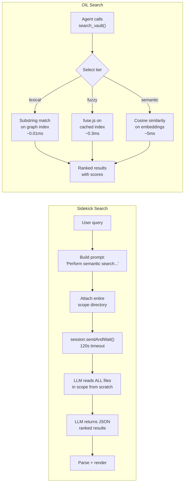

| Metric | Sidekick | OIL |
|--------|----------|-----|
| **Cold search latency** | Seconds to minutes (LLM-dependent) | ~14ms (graph build) + ~0.01ms (lexical) |
| **Warm search latency** | Same as cold (no caching) | ~0.01ms (lexical), ~0.3ms (fuzzy) |
| **Search determinism** | Non-deterministic (LLM variance) | Deterministic (index-based) |
| **Cost per search** | Full LLM inference ($$) | Zero LLM cost (local) |
| **Result caching** | None | Index persisted to disk |
| **Incremental updates** | None (re-reads everything) | mtime-based incremental rebuild |
| **Search precision** | LLM-dependent | 1.00 (lexical), varies (fuzzy/semantic) |
| **Search recall** | LLM-dependent | 0.43 (lexical) → 0.80 (graph-augmented) |

## Context Building Comparison

```
┌─────────────────────────────────────────────────────────────────────────────┐
│  SIDEKICK: "Send everything, let the LLM figure it out"                      │
│                                                                              │
│  Agent asks: "What's the context for Project X?"                             │
│                                                                              │
│  ┌──────────────────────────────────────────────────────────────────────┐   │
│  │ 1. Send entire scope directory as attachment                         │   │
│  │ 2. SDK reads all files in scope                                      │   │
│  │ 3. SDK truncates to fit context window (invisible to user)           │   │
│  │ 4. LLM reasons over partial/random slice of vault                    │   │
│  │ 5. Return response                                                   │   │
│  └──────────────────────────────────────────────────────────────────────┘   │
│                                                                              │
│  Token cost: HIGH (entire scope sent raw)                                    │
│  Relevance:  LOW  (no pre-filtering)                                         │
│  Latency:    HIGH (LLM processes everything)                                 │
│  Round-trips: 1 (but expensive)                                              │
│                                                                              │
├──────────────────────────────────────────────────────────────────────────────┤
│                                                                              │
│  OIL: "Pre-assemble exactly what's needed"                                   │
│                                                                              │
│  Agent calls: get_customer_context({ customer: "Project X" })                │
│                                                                              │
│  ┌──────────────────────────────────────────────────────────────────────┐   │
│  │ 1. Cache check → hit? Return immediately (0 disk reads)              │   │
│  │ 2. Cache miss → vault.readNote() → cache result                      │   │
│  │ 3. Parse structured sections (Opportunities, Team, Action Items)     │   │
│  │ 4. Graph O(1) backlink lookup → linked people, meetings              │   │
│  │ 5. Return pre-assembled JSON (excerpts, not full content)            │   │
│  └──────────────────────────────────────────────────────────────────────┘   │
│                                                                              │
│  Token cost: LOW  (excerpts ~200 chars, not full notes)                      │
│  Relevance:  HIGH (structured extraction, graph traversal)                   │
│  Latency:    LOW  (cache + O(1) graph lookups)                               │
│  Round-trips: 1 (but cheap — server did the assembly)                        │
│                                                                              │
└─────────────────────────────────────────────────────────────────────────────┘
```

## Feature-by-Feature Matrix

| Capability | Sidekick | OIL | Gap |
|------------|----------|-----|-----|
| **Graph index** | None | Persistent bidirectional graph with O(1) backlinks | Critical |
| **Search indexing** | None (LLM pass-through) | 3-tier: lexical → fuzzy (fuse.js) → semantic (embeddings) | Critical |
| **Session cache** | SDK-managed (in-flight only) | LRU 200-note cache with 5min TTL | High |
| **Embedding index** | None | 384-dim MiniLM-L6-v2, persisted, local | Medium |
| **File watcher** | Config files only (500ms debounce) | Full vault (chokidar), invalidates all caches | High |
| **Incremental rebuild** | N/A (no index) | mtime-based graph rebuild on startup | High |
| **Write safety** | Direct writes (editor menu) | 2-tier gate: auto-confirm safe ops, diff+confirm for others | Medium |
| **Audit logging** | None | `_agent-log/` with timestamps, tool names, paths | Low |
| **Response shaping** | Full files sent raw | Excerpts (~200 chars), scored rankings, structured JSON | Critical |
| **Frontmatter query** | None | SQL-like `where/and/or/order_by/limit` | High |
| **Cross-file context** | None (files are isolated blobs) | Graph traversal, backlinks, tag co-occurrence | Critical |
| **Token efficiency** | ~1,036 tokens/turn (schema overhead) | ~612 tokens/turn (benchmark data) | Medium |
| **MCP round-trips** | N/A (single SDK call, but expensive) | 3.3× fewer calls (composite tools) | High |
| **Ghost text** | Yes (CM6 inline suggestions) | No (server-side, not an editor plugin) | Sidekick advantage |
| **In-editor UI** | Full chat/search/triggers panel | None (MCP tools only) | Sidekick advantage |
| **Editor integration** | Context menus, text selection tasks | None | Sidekick advantage |
| **Trigger system** | Cron + glob-based triggers | None (agents call tools on demand) | Sidekick advantage |
| **Multi-model support** | Yes (model picker) | Model-agnostic (MCP client decides) | Neutral |
| **Agent definitions** | In-vault `*.agent.md` files | N/A (agents are external MCP clients) | Different paradigm |

## Workflow Efficiency: Side-by-Side

### "Get me up to speed on Contoso"

```
SIDEKICK                                  OIL
━━━━━━━━                                  ━━━

1. User types prompt in chat               1. Agent calls get_vault_context()
2. Plugin sends entire vault scope             → Returns vault map, top tags,
   as directory attachment                       most-linked notes
3. SDK reads all files in scope
4. LLM receives (truncated) context         2. Agent calls get_customer_context(
5. LLM assembles answer from                    { customer: "Contoso" })
   whatever it can see                          → Returns pre-assembled:
6. Stream response back                           • Frontmatter
                                                  • Opportunities [{name, guid}]
Round-trips to LLM: 1 (expensive)                 • Team [{name, role}]
Vault files read: ALL in scope                    • Action items [{text, done}]
Context quality: Unknown (SDK truncation)         • Backlinks (people, meetings)
Token cost: very high
                                            Round-trips: 2 (cheap, local assembly)
                                            Vault files read: 1 + graph O(1)
                                            Context quality: Precise, structured
                                            Token cost: low (~200 chars/note)
```

### "Find all notes about the migration project"

```
SIDEKICK                                  OIL
━━━━━━━━                                  ━━━

1. User enters query in search panel        1. Agent calls search_vault(
2. Plugin sends: "Perform semantic              { query: "migration",
   search..." + entire scope directory            tier: "fuzzy" })
3. LLM reads all files from scratch
4. LLM ranks by semantic understanding      → Pre-built fuse.js index:
5. LLM returns JSON array                      ~0.3ms, ranked, scored
6. Plugin parses + renders
                                            2. Agent calls query_graph(
Latency: seconds to minutes                    { from: "migration-results",
Cost: full LLM inference                        hops: 1 })
Determinism: low (LLM variance)
                                            → O(1) graph traversal:
                                               linked files, meetings, people

                                            Latency: <1ms total
                                            Cost: zero (local)
                                            Determinism: perfect
```

## Where Sidekick Wins

Despite the context-efficiency gap, Sidekick has significant advantages:

```
┌─────────────────────────────────────────────────────────────────────────┐
│  SIDEKICK ADVANTAGES (things OIL cannot do)                              │
│                                                                          │
│  1. EDITOR INTEGRATION                                                   │
│     • Ghost-text autocomplete (CM6 inline suggestions)                  │
│     • Right-click text selection → 10 built-in transforms               │
│     • Edit modal with tone/format/length controls                       │
│     • Drag-drop files into chat                                         │
│     • Image paste from clipboard                                        │
│     OIL is a headless server — zero editor integration.                  │
│                                                                          │
│  2. INTERACTIVE CHAT UI                                                  │
│     • Streaming response rendering in Markdown                          │
│     • Tool approval modals                                              │
│     • Session management (switch, resume, delete)                       │
│     • In-vault config UI (agents, skills, MCP servers)                  │
│     OIL returns JSON to the MCP client — no rich UI.                     │
│                                                                          │
│  3. TRIGGER SYSTEM                                                       │
│     • Cron-based scheduling (e.g., "every morning at 8am")              │
│     • Glob-based file watchers (e.g., "when *.md in projects/ changes") │
│     • Trigger → agent → session → response pipeline                     │
│     OIL has no scheduling — agents call tools, not vice versa.           │
│                                                                          │
│  4. MULTI-SERVICE ORCHESTRATION                                          │
│     • MCP server connections (arbitrary external tools)                  │
│     • Skills system (pluggable capabilities)                            │
│     • Agent definitions with custom instructions                        │
│     OIL IS one MCP server — it doesn't orchestrate others.               │
│                                                                          │
│  5. ZERO SETUP                                                           │
│     • Install plugin → done. Obsidian handles everything.               │
│     • No Node.js, no CLI, no config files needed                        │
│     OIL requires Node 20+, clone, npm install, env vars, MCP config.    │
│                                                                          │
└─────────────────────────────────────────────────────────────────────────┘
```

## Complementary, Not Competing

These are not competing projects — they occupy different layers of the stack and can work together:

```
┌─────────────────────────────────────────────────────────────────────────────┐
│                        COMBINED ARCHITECTURE                                 │
│                                                                              │
│  ┌──────────────────────────────────────────────────┐                       │
│  │             Obsidian (editor)                      │                       │
│  │  ┌──────────────────────────────────────────────┐ │                       │
│  │  │  SIDEKICK PLUGIN                              │ │                       │
│  │  │  • Chat UI, ghost text, triggers              │ │                       │
│  │  │  • Editor integration, text tasks             │ │                       │
│  │  │  • Session management                         │ │                       │
│  │  │  • Orchestrates MCP servers (including OIL)   │ │                       │
│  │  └──────────┬───────────────────────────────────┘ │                       │
│  └─────────────┼─────────────────────────────────────┘                       │
│                │ MCP protocol (via mcp.json config)                          │
│                ▼                                                              │
│  ┌──────────────────────────────────────────────────┐                       │
│  │  OIL MCP SERVER                                    │                       │
│  │  • Pre-indexed graph + search + cache              │                       │
│  │  • Structured context assembly                     │                       │
│  │  • Smart retrieval (lexical/fuzzy/semantic)        │                       │
│  │  • Gated writes with audit trail                   │                       │
│  │  • Response shaping (excerpts, not raw files)      │                       │
│  └──────────────────────────────────────────────────┘                       │
│                                                                              │
│  Sidekick provides the UI + orchestration layer                              │
│  OIL provides the intelligence + context layer                               │
│  Together: efficient context references WITH rich editor integration         │
│                                                                              │
└─────────────────────────────────────────────────────────────────────────────┘
```

**How this would work:**

1. Sidekick connects to OIL as one of its MCP servers (via `sidekick/tools/mcp.json`)
2. When Sidekick needs vault context, the LLM calls OIL tools (`search_vault`, `get_customer_context`, `query_graph`) instead of reading raw files
3. OIL returns pre-assembled, token-efficient responses from its local indices
4. Sidekick renders the results in its rich chat/search/trigger UI
5. Ghost text and text selection tasks continue to work as-is (editor-native features)

## What Sidekick Could Adopt from OIL

Without full OIL integration, Sidekick could adopt key patterns locally:

| OIL Pattern | How Sidekick Could Implement It | Effort |
|-------------|-------------------------------|--------|
| **Graph index** | Use Obsidian's `app.metadataCache` — already has links, backlinks, tags | Low |
| **Metadata pre-filter** | Query `metadataCache.getFileCache()` before sending to LLM | Low |
| **Response shaping** | Send excerpts (~200 chars) + metadata instead of full files | Medium |
| **Session cache** | Track which files are already in the SDK's session context | Medium |
| **Search tiering** | Add local fuzzy search (fuse.js) as fast pre-filter before LLM search | Medium |
| **Query result cache** | Map `hash(query + scope)` → results with TTL, invalidate on file change | Low |
| **Incremental context** | Diff what's new/changed since last turn, only send deltas | High |
| **Write gate** | Add diff preview before editor replacements (text tasks, triggers) | Medium |

### The `app.metadataCache` Shortcut

Obsidian already maintains much of what OIL builds from scratch:

```typescript
// What Obsidian gives you for FREE (no indexing needed):

const cache = app.metadataCache;

// Links & backlinks
cache.resolvedLinks["note.md"]           // → { "other.md": 2 }
cache.getBacklinksForFile(file)          // → all files linking to this one

// Frontmatter
cache.getFileCache(file)?.frontmatter    // → { tags: [...], type: "..." }

// Headings
cache.getFileCache(file)?.headings       // → [{ heading: "...", level: 1 }]

// Tags (inline + frontmatter)
cache.getFileCache(file)?.tags           // → [{ tag: "#project", ... }]

// Sections with line offsets
cache.getFileCache(file)?.sections       // → [{ type: "heading", position: ... }]

// Listen for changes
app.metadataCache.on("changed", (file) => {
  // Re-index only this file
});
```

This one API provides the equivalent of OIL's:
- `GraphIndex` (backlinks, forward links, tags)
- `vault.ts` (frontmatter parsing, section parsing)
- `watcher.ts` (change events with granular invalidation)

**Without adding any new dependencies.**
